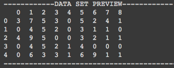
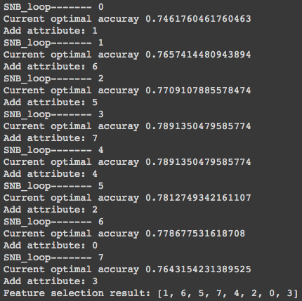
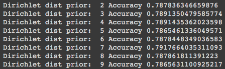
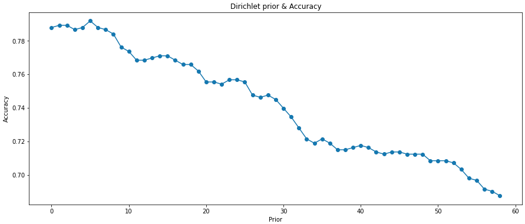
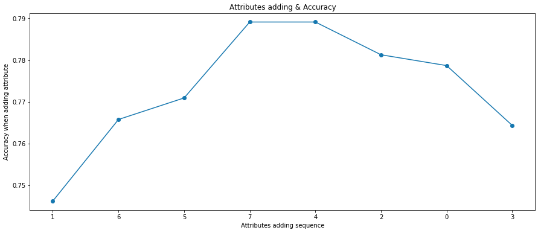

# Hand-made_Naive_Bayesian_classifier

I currently use Python with pandas and numpy lib to consist a basic naive bayesian classifier .

With:
1. Selective Naive Bayesian method to selecte the best attributes which can result the best accuracy.

2. 5 fold cross validation in __init__, you can change it with other numbers like 10 or 2.

3. Laplace's estimate is using with every possibally attributes value.

4. Dirichlet prior is using and testing after finish the SNB. 

Warning:

1.Can't process the missing value.

2.Can only process "non-string attribute", including all of the attributes. 

for more related imformation, please check wiki pedia below

https://en.wikipedia.org/wiki/Naive_Bayes_classifier

Below is the example output with Pima dataset from UCI Machine Learning DB

1. The discretization result

2. The SNB process with attribute and accuracy

3. The Dirichlet prior test, from 2 all the way to 60 (1 is in the case of SNB already)

4. The accuracy with different Dirichlet dist prior

5. The accuracy when different attributes adding in SNB process
6. 

